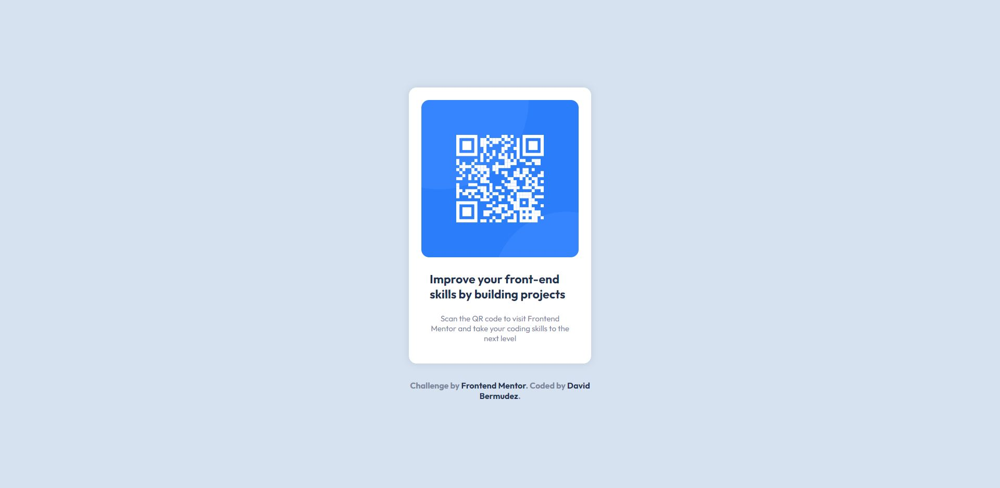

# Frontend Mentor - QR code component solution

This is a solution to the [QR code component challenge on Frontend Mentor](https://www.frontendmentor.io/challenges/qr-code-component-iux_sIO_H). Frontend Mentor challenges help you improve your coding skills by building realistic projects. 

## Table of contents

- [Overview](#overview)
  - [Screenshot](#screenshot)
  - [Links](#links)
- [My process](#my-process)
  - [Built with](#built-with)
  - [What I learned](#what-i-learned)
  - [Continued development](#continued-development)
  - [Useful resources](#useful-resources)
- [Author](#author)
- [Acknowledgments](#acknowledgments)

## Overview

### Screenshot

### Links

- Solution URL: [Solution](https://github.com/DavidBmdz/QRcode-exercise)

## My process

### Built with

- Semantic HTML5 markup
- CSS custom properties
- Flexbox

### What I learned

In this exercise I learned how to center all the elements on the screen, using justify-content and align-items. Moreover, what I learned too is the use of images, text and structuring it within the size of the width. The shadow-box was new for me and it makes the QRCode look nice.

### Useful resources

- [Shadow-box](https://developer.mozilla.org/es/docs/Web/CSS/box-shadow) - This helped me to understand how the shadow-box works. I really liked this pattern and will use it going forward.
- [Flexbox](https://flexboxfroggy.com) - This is an amazing web game which helped me finally understand the flexbox and how to place items. I'd recommend it to anyone still learning this concept.

## Author

- LinkedIn - [David Bermudez](https://www.linkedin.com/david-bermudez-538299271/)

